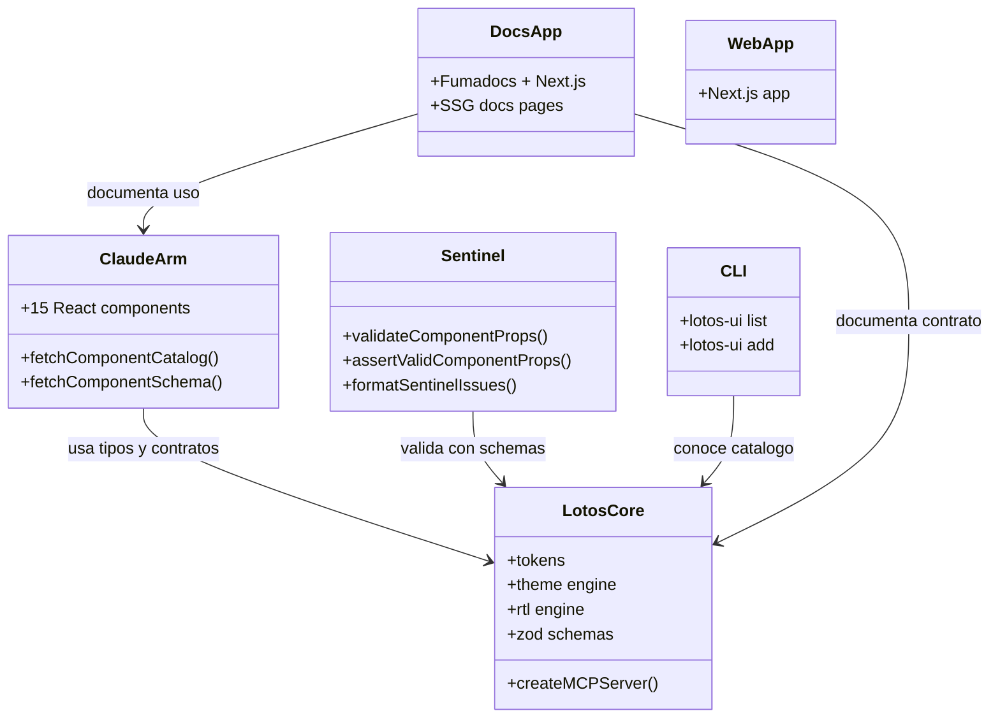
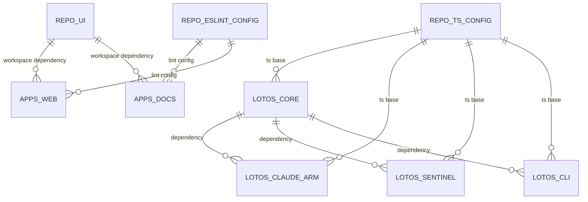
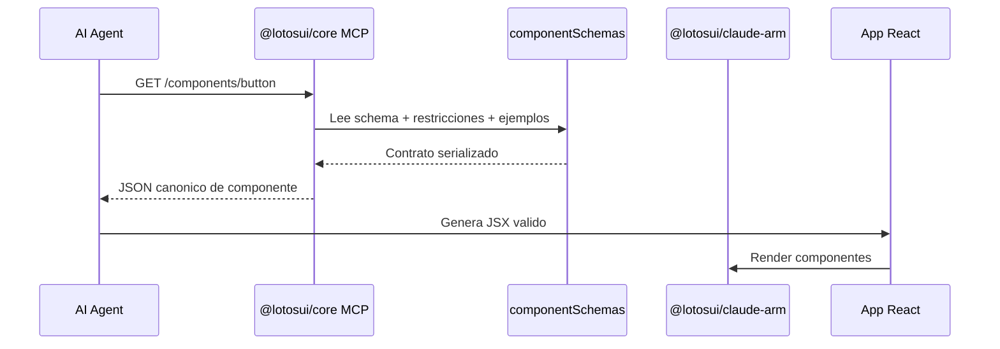
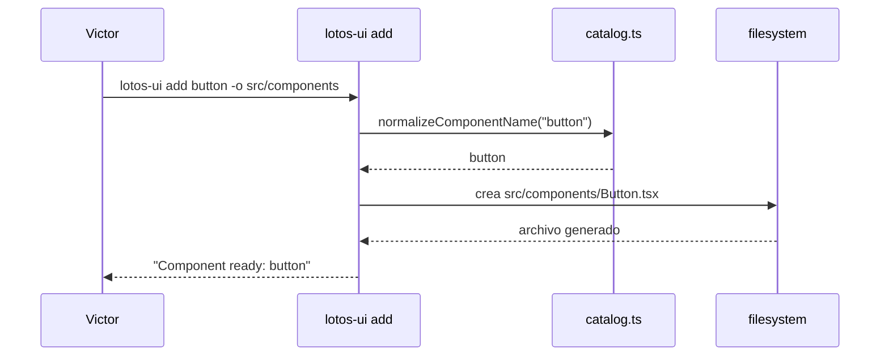

# Manual Operativo Total - LotOS UI (Fase 1)

Version manual: 1.0  
Fecha base tecnica: 2026-02-23  
Audiencia: Victor (operacion tecnica, mantenimiento, evolucion)  
Estado del sistema: Estable en Fase 1 (build, lint, typecheck y pruebas en verde)

## 0. Objetivo del manual
Este manual documenta TODO lo necesario para:

- Entender que es LotOS UI y para que sirve.
- Levantar el sistema localmente desde cero.
- Operarlo dia a dia sin depender de nadie.
- Probar calidad tecnica antes de cambios.
- Integrar AI agents (MCP) y sacar el maximo provecho.
- Resolver fallas comunes.
- Mantener una disciplina de release profesional.

Este es el documento base operativo. Luego puedes exportarlo a formato visual.

## 1. Que es LotOS UI
LotOS UI es un ecosistema de componentes UI orientado a AI-first development:

- `@lotosui/core`: contrato central (tokens, schemas Zod, engine de tema, RTL, MCP server).
- `@lotosui/claude-arm`: libreria React productiva (15 componentes accesibles).
- `@lotosui/sentinel`: validacion runtime para evitar composiciones invalidas.
- `@lotosui/cli`: CLI para scaffolding rapido de wrappers de componentes.
- `apps/docs`: sitio de documentacion (Fumadocs + Next.js).
- `apps/web`: app Next.js de soporte/demo.

Propuesta de valor:

- Menos alucinacion en AI gracias a MCP + schemas.
- Mejor accesibilidad por guardrails de Sentinel.
- Flujo de desarrollo reproducible con Turborepo.

## 2. Arquitectura del sistema

### 2.1 Diagrama de contexto (alto nivel)
```mermaid
flowchart LR
    U[Dev / Victor] --> CLI[@lotosui/cli]
    U --> DOCS[apps/docs]
    U --> WEB[apps/web]
    U --> TEST[Turbo Pipeline]

    AI[AI Agent] --> MCP[@lotosui/core MCP Server]
    MCP --> SCHEMAS[@lotosui/core schemas]
    SCHEMAS --> ARM[@lotosui/claude-arm]
    ARM --> APP[Aplicacion Consumidora React]
    APP --> SENT[@lotosui/sentinel]

    DOCS --> ARM
    DOCS --> CORE[@lotosui/core]
    WEB --> UI[@repo/ui]
```

### 2.2 UML (modulos principales)


### 2.3 Diagrama de relacion (dependencias de paquetes)


### 2.4 Flujo AI con MCP (sequence)


### 2.5 Flujo CLI (sequence)


## 3. Estructura real del repo
Ruta raiz:

`C:\Users\Rick\Documents\LotosTechnologies\LotOS UI\lotos-ui`

Estructura:

```text
lotos-ui/
  apps/
    docs/              # Documentacion Next.js + Fumadocs
    web/               # App Next.js
  packages/
    core/              # Tokens, schemas, theme, rtl, MCP
    claude-arm/        # Componentes React + cliente MCP
    sentinel/          # Validacion runtime
    cli/               # CLI lotos-ui
    ui/                # Paquete compartido base del monorepo
    eslint-config/     # Configuracion ESLint
    typescript-config/ # Configuracion TS compartida
  turbo.json
  pnpm-workspace.yaml
  package.json
```

## 4. Requisitos del entorno

### 4.1 Minimos
- Node.js `>=18` (recomendado 20 LTS).
- pnpm `9.x`.
- Git.
- PowerShell o terminal equivalente.

### 4.2 Nota importante en Windows (ExecutionPolicy)
Si `pnpm` falla por politica de scripts de PowerShell, usa:

```powershell
pnpm.cmd <comando>
```

Ejemplo:

```powershell
pnpm.cmd install
pnpm.cmd build
```

## 5. Setup inicial (paso a paso)

1. Entrar al repo:
```powershell
cd "C:\Users\Rick\Documents\LotosTechnologies\LotOS UI\lotos-ui"
```

2. Instalar dependencias:
```powershell
pnpm.cmd install
```

3. Validar baseline:
```powershell
pnpm.cmd lint
pnpm.cmd check-types
pnpm.cmd build
pnpm.cmd exec turbo run test
pnpm.cmd exec turbo run test:a11y
pnpm.cmd exec turbo run test:mcp
```

4. Levantar desarrollo:
```powershell
pnpm.cmd dev
```

Puertos esperados:
- Docs: `http://localhost:3001`
- Web: `http://localhost:3000`

## 6. Comandos operativos por capa

### 6.1 Monorepo completo
```powershell
pnpm.cmd dev
pnpm.cmd lint
pnpm.cmd check-types
pnpm.cmd build
pnpm.cmd exec turbo run test
pnpm.cmd exec turbo run test:a11y
pnpm.cmd exec turbo run test:mcp
```

### 6.2 Paquetes clave
`@lotosui/core`
```powershell
pnpm.cmd --filter @lotosui/core build
pnpm.cmd --filter @lotosui/core test
```

`@lotosui/claude-arm`
```powershell
pnpm.cmd --filter @lotosui/claude-arm build
pnpm.cmd --filter @lotosui/claude-arm test
pnpm.cmd --filter @lotosui/claude-arm test:a11y
pnpm.cmd --filter @lotosui/claude-arm test:mcp
```

`@lotosui/sentinel`
```powershell
pnpm.cmd --filter @lotosui/sentinel build
pnpm.cmd --filter @lotosui/sentinel test
```

`@lotosui/cli`
```powershell
pnpm.cmd --filter @lotosui/cli build
pnpm.cmd --filter @lotosui/cli test
```

`apps/docs`
```powershell
pnpm.cmd --filter docs dev
pnpm.cmd --filter docs build
pnpm.cmd --filter docs check-types
```

## 7. Uso funcional del sistema

### 7.1 Uso como consumidor de componentes
Instalar en proyecto React:

```bash
npm install @lotosui/claude-arm
```

Importar estilos globales una vez:

```tsx
import '@lotosui/claude-arm/styles.css';
```

Usar componentes:

```tsx
import { Button, Input, Modal } from '@lotosui/claude-arm';
```

### 7.2 Catalogo actual de componentes (15)

Primitivos:
- Button
- Badge
- Card
- Input
- Modal

Form controls:
- Select
- Checkbox
- Switch
- Textarea
- Tooltip

Compuestos:
- Dropdown
- RadioGroup
- Combobox
- Tabs
- Accordion

### 7.3 Reglas de accesibilidad criticas (operativas)
- `Input` debe tener `label` o `aria-label`.
- `Button` no debe combinar `disabled` + `loading`.
- `Badge` tipo `dot` sin texto requiere `aria-label`.
- `Modal` requiere `title`.
- En componentes interactivos, respetar roles/aria predefinidos.

## 8. Engine de tema y RTL

### 8.1 Tema (light/dark/system)
API en `@lotosui/core`:
- `generateCSSVariables()`
- `applyTheme(mode)`
- `getActiveTheme()`

Uso:

```ts
import { applyTheme } from '@lotosui/core';

applyTheme('dark');
applyTheme('light');
applyTheme('system');
```

### 8.2 RTL
API en `@lotosui/core`:
- `toLogical()`
- `setDirection('ltr' | 'rtl')`
- `getDirection()`
- `isRTL()`

Uso:

```ts
import { setDirection } from '@lotosui/core';

setDirection('rtl');
```

## 9. Sentinel (validacion runtime)
Archivo clave: `packages/sentinel/src/index.ts`

Funciones disponibles:
- `validateComponentProps(component, props)`
- `assertValidComponentProps(component, props)`
- `formatSentinelIssues(issues)`

Ejemplo:

```ts
import { validateComponentProps } from '@lotosui/sentinel';

const result = validateComponentProps('button', {
  variant: 'primary',
  loading: true,
  disabled: true
});

// result.valid = true
// result.issues incluye warning button-disabled-loading
```

Casos que cubre hoy:
- Warning button: `disabled + loading`.
- Warning input: sin `label/aria-label`.
- Warning badge dot: sin `aria-label`.
- Error schema: cuando props no cumplen Zod.

## 10. MCP server (AI enablement)
Archivo clave: `packages/core/src/mcp/server.ts`

Endpoints:
- `GET /health`
- `GET /components`
- `GET /components/:name`
- `GET /components/:name/examples`

Puerto:
- Default `3100`
- Variable `MCP_PORT` soportada por el sistema.

### 10.1 Levantar MCP local
```powershell
pnpm.cmd --filter @lotosui/core build
node packages/core/dist/mcp/server.js
```

Con puerto custom:
```powershell
$env:MCP_PORT=3200
node packages/core/dist/mcp/server.js
```

### 10.2 Verificacion rapida MCP
```powershell
curl http://localhost:3100/health
curl http://localhost:3100/components
curl http://localhost:3100/components/button
curl http://localhost:3100/components/button/examples
```

### 10.3 Cliente MCP desde claude-arm
`@lotosui/claude-arm` exporta:
- `fetchComponentCatalog(baseUrl?)`
- `fetchComponentSchema(componentName, baseUrl?)`

Ejemplo:

```ts
import { fetchComponentSchema } from '@lotosui/claude-arm';

const button = await fetchComponentSchema('button', 'http://localhost:3100');
```

## 11. CLI `@lotosui/cli`
Archivo clave: `packages/cli/src/index.ts`

Comandos:
- `lotos-ui list`
- `lotos-ui add <component> [-o|--out-dir <dir>] [-f|--force]`

### 11.1 Instalar y usar localmente
```powershell
pnpm.cmd --filter @lotosui/cli build
pnpm.cmd --filter @lotosui/cli exec node dist/index.js list
pnpm.cmd --filter @lotosui/cli exec node dist/index.js add button -o src/components
```

Salida esperada:
- genera wrapper `Button.tsx` en directorio objetivo.

## 12. Flujo de trabajo recomendado (dia a dia)

### 12.1 Flujo de desarrollo seguro
1. Crear rama feature.
2. Implementar cambios.
3. Correr gates locales:
   - `pnpm.cmd lint`
   - `pnpm.cmd check-types`
   - `pnpm.cmd build`
   - `pnpm.cmd exec turbo run test`
4. Si toca AI/MCP:
   - `pnpm.cmd exec turbo run test:mcp`
5. Si toca accesibilidad:
   - `pnpm.cmd exec turbo run test:a11y`
6. Commit solo con verde total.

### 12.2 Criterio de merge
No se mergea si falla cualquiera de:
- lint
- check-types
- build
- tests relevantes (`test`, `test:a11y`, `test:mcp`)

## 13. Guia para sacar el maximo provecho con AI

### 13.1 Patron recomendado
1. Levantar MCP.
2. Darle al agente la URL MCP.
3. Pedirle que primero consulte schema y restricciones.
4. Exigir que use componentes de `@lotosui/claude-arm`.
5. Validar props con Sentinel en runtime.

### 13.2 Prompt operativo sugerido para agentes
```text
Usa solo componentes de @lotosui/claude-arm.
Antes de generar JSX, consulta MCP:
- GET /components/<name>
Respeta restricciones de cada componente.
No inventes props fuera del schema.
Prioriza accesibilidad WCAG (label, aria, keyboard).
```

### 13.3 Anti-patterns (evitar)
- Generar JSX sin revisar MCP.
- Saltarse Sentinel en integraciones dinamicas.
- Meter estilos ad-hoc que rompan tokens o a11y.
- Ignorar warnings de accessibilidad en desarrollo.

## 14. Documentacion interna (apps/docs)

`apps/docs` usa:
- Next.js 16
- Fumadocs
- contenido MDX en `apps/docs/content/docs`

Nota operativa:
- `check-types` en docs ejecuta `fumadocs-mdx` primero para evitar inconsistencia en `.source/`.

Comandos docs:
```powershell
pnpm.cmd --filter docs dev
pnpm.cmd --filter docs build
pnpm.cmd --filter docs check-types
```

## 15. Calidad y pruebas (matriz)

### 15.1 Cobertura por paquete
- `@lotosui/core`: tests de tokens/theme/rtl/schemas.
- `@lotosui/claude-arm`: tests de 15 componentes + a11y + mcp contract.
- `@lotosui/sentinel`: tests de validacion y formato de issues.
- `@lotosui/cli`: tests de catalogo y scaffolding.

### 15.2 Pipeline de calidad oficial (fase 1)
```powershell
pnpm.cmd lint
pnpm.cmd check-types
pnpm.cmd build
pnpm.cmd exec turbo run test
pnpm.cmd exec turbo run test:a11y
pnpm.cmd exec turbo run test:mcp
```

Si esto pasa, el estado tecnico base esta estable.

## 16. Despliegue

### 16.1 Vercel (root)
Archivo: `vercel.json`

- `buildCommand`: `pnpm --filter docs build`
- `installCommand`: `pnpm install`
- `outputDirectory`: `apps/docs/.next`

### 16.2 Vercel (apps/docs)
Archivo: `apps/docs/vercel.json`

Incluye:
- build/install desde raiz.
- headers de seguridad.
- cache de fuentes.

## 17. Troubleshooting completo

### 17.1 `pnpm` bloqueado por PowerShell
Error: execution policy / `.ps1` bloqueado.  
Solucion:

```powershell
pnpm.cmd <comando>
```

### 17.2 Falla de types en docs por `.source/`
Sintoma:
- export faltante en `apps/docs/.source/server.ts`
- type errors en `source.ts`

Solucion:

```powershell
pnpm.cmd --filter docs exec fumadocs-mdx
pnpm.cmd --filter docs check-types
```

### 17.3 `test:a11y` y warning de canvas en jsdom
Puede aparecer warning de `HTMLCanvasElement.getContext` por `axe-core`.
Actualmente el test deshabilita regla `color-contrast` para ambiente jsdom.
No bloquea si los tests pasan.

### 17.4 Puerto MCP ocupado
Solucion:

```powershell
$env:MCP_PORT=3200
node packages/core/dist/mcp/server.js
```

### 17.5 Archivo ya existe al usar CLI `add`
Error:
- `File already exists: ...`

Solucion:
- usar `--force` si quieres overwrite.

```powershell
pnpm.cmd --filter @lotosui/cli exec node dist/index.js add button -o src/components --force
```

## 18. Checklists operativos

### 18.1 Checklist onboarding Victor
1. Clonar repo.
2. `pnpm.cmd install`
3. Correr pipeline completo.
4. Levantar `docs` y `web`.
5. Levantar MCP y validar endpoint `/health`.
6. Probar CLI `list` y `add`.

### 18.2 Checklist antes de PR
1. `pnpm.cmd lint`
2. `pnpm.cmd check-types`
3. `pnpm.cmd build`
4. `pnpm.cmd exec turbo run test`
5. Si toca accesibilidad: `test:a11y`
6. Si toca contrato AI: `test:mcp`

### 18.3 Checklist antes de release
1. Todo verde en local.
2. Changelog actualizado.
3. Version bump definido.
4. Build de docs ok.
5. Smoke test MCP (`/health`, `/components/button`).
6. Tag de release en git.

### 18.4 Checklist de incidente (hotfix)
1. Reproducir bug.
2. Crear test que falle.
3. Aplicar fix minimo.
4. Correr pipeline completo.
5. Publicar parche con nota de impacto.

## 19. FAQ rapido

### Q: Cual app es productiva para documentacion?
`apps/docs`.

### Q: Donde vive el contrato canonico de props?
`packages/core/src/schemas/components.ts`.

### Q: Como obligo a AI a no inventar props?
MCP + schemas + Sentinel en runtime.

### Q: Donde agrego nuevos componentes?
Primero schema en `@lotosui/core`, luego implementacion en `@lotosui/claude-arm`, luego docs y tests.

### Q: Cual comando valida TODO?
No hay uno unico canonico; usa la secuencia oficial de la seccion 15.2.

## 20. Guia de expansion futura (post Fase 1)
Cuando avances:

1. Expandir schemas en `@lotosui/core`.
2. Implementar componente en `@lotosui/claude-arm`.
3. Agregar guardrail en `@lotosui/sentinel` si aplica.
4. Agregar scaffolding en `@lotosui/cli` si aplica.
5. Documentar en `apps/docs/content/docs/components`.
6. Agregar tests unitarios + a11y + mcp contract.
7. Correr pipeline completo.

## 21. Comandos de referencia (chuleta final)

```powershell
# Setup
pnpm.cmd install

# Quality gates
pnpm.cmd lint
pnpm.cmd check-types
pnpm.cmd build
pnpm.cmd exec turbo run test
pnpm.cmd exec turbo run test:a11y
pnpm.cmd exec turbo run test:mcp

# Dev
pnpm.cmd dev
pnpm.cmd --filter docs dev
pnpm.cmd --filter web dev

# MCP
pnpm.cmd --filter @lotosui/core build
node packages/core/dist/mcp/server.js
curl http://localhost:3100/health

# CLI
pnpm.cmd --filter @lotosui/cli build
pnpm.cmd --filter @lotosui/cli exec node dist/index.js list
pnpm.cmd --filter @lotosui/cli exec node dist/index.js add button -o src/components
```

---

Manual listo para usar como base de version visual/PDF.  
Si se mantiene este documento actualizado, Victor puede operar el sistema end-to-end sin dependencia externa.
