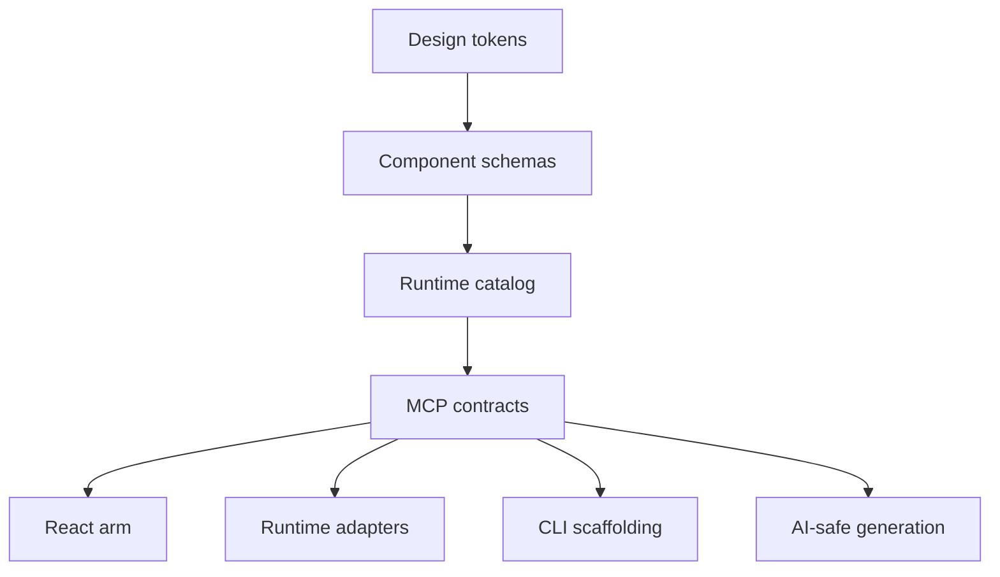
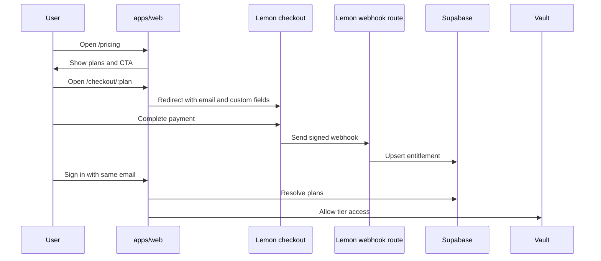
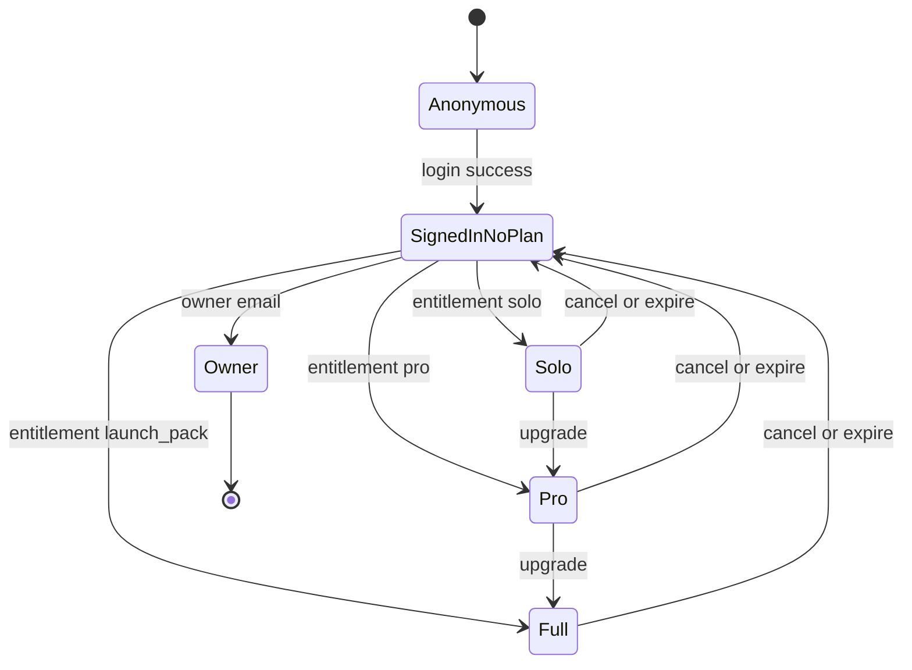
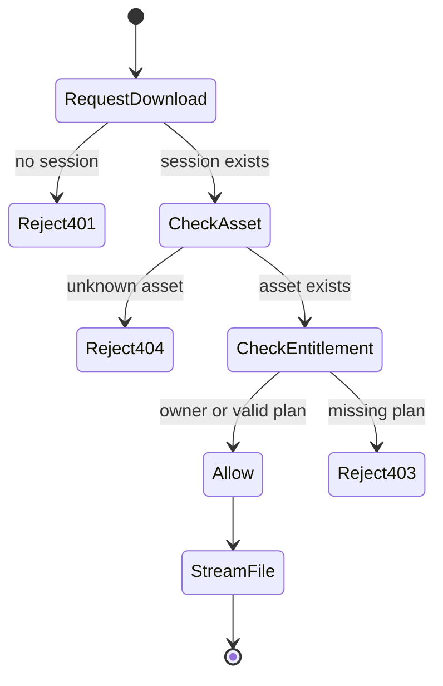
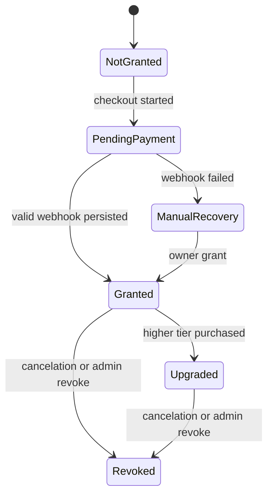
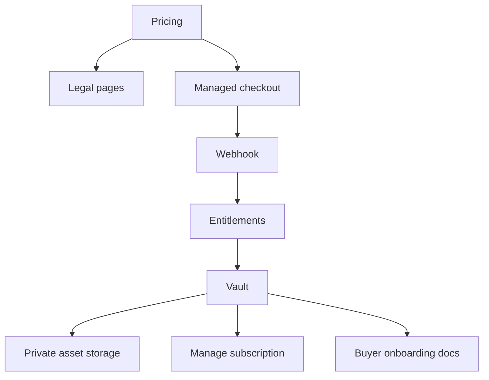

# LotOS UI Software Architecture Map

Fecha: 2026-03-08

Objetivo: entender la arquitectura del producto, la separacion entre capa publica y premium, y el flujo de pago -> entitlement -> vault.

## 1. Vista general

```mermaid
flowchart LR
  A[Public user] --> B[apps/web]
  B --> C[Pricing]
  B --> D[Login]
  B --> E[Vault]
  C --> F[Lemon checkout]
  F --> G[/api/webhooks/lemon]
  G --> H[Supabase entitlements]
  D --> I[NextAuth Google]
  I --> E
  E --> J[/api/download/:asset]
  J --> K[Protected assets]

  subgraph Public Layer
    L[@lotosui/claude-arm]
    M[@lotosui/core]
    N[@lotosui/cli]
    O[@lotosui/web-components]
  end

  subgraph Premium Layer
    P[packages/pro/previews]
    Q[packages/pro/layouts]
    R[packages/pro/industry-kits]
    S[packages/pro/launch-exclusive]
  end

  M --> N
  M --> O
  M --> L
  J --> P
  J --> Q
  J --> R
  J --> S
```

## 2. Boundaries

### Public layer

- docs
- demos
- MIT packages
- CLI
- runtime exploration

### Commercial layer

- pricing
- checkout
- entitlement issuance
- vault
- protected asset delivery

### Premium payload

- previews
- layouts
- industry kits
- launch-exclusive assets

## 3. Contract-first core



## 4. Checkout and unlock sequence



## 5. Vault access state machine



## 6. Download authorization state machine



## 7. Entitlement lifecycle



## 8. Actual software modules

### Web commerce

- `apps/web/app/pricing/page.tsx`
- `apps/web/app/checkout/[plan]/page.tsx`
- `apps/web/app/api/webhooks/lemon/route.ts`
- `apps/web/app/api/download/[asset]/route.ts`
- `apps/web/app/vault/*`
- `apps/web/app/sales-config.ts`

### Entitlements and auth

- `apps/web/lib/entitlements.ts`
- `apps/web/lib/auth-server.ts`
- `apps/web/proxy.ts`
- `apps/web/supabase/entitlements.sql`

### Product assets

- `packages/pro/distribution/*.json`
- `packages/pro/previews/*`
- `packages/pro/layouts/*`
- `packages/pro/industry-kits/*`
- `packages/pro/launch-exclusive/*`

### Public product core

- `packages/claude-arm/*`
- `packages/core/*`
- `packages/cli/*`
- `packages/web-components/*`

## 9. Current architecture risks

### Risk A: checkout provider mismatch

Current state:

- automation coded for Lemon
- current active checkout URLs still fail go-live verification

Impact:

- payment can happen without guaranteed unlock

### Risk B: premium asset leakage

Current state:

- fallback download path still points to `packages/pro/...`

Impact:

- premium value is not as defensible while repo stays public

### Risk C: legal/commercial metadata gap

Current state:

- pricing exists
- legal surfaces are missing

Impact:

- purchase path is weaker than the software path

## 10. Target architecture for trustworthy commerce



Objetivo final:

- compra clara
- unlock automatico real
- activos realmente privados
- postventa visible
- cancelacion simple

Eso convierte una demo comercial en una plataforma vendible.
